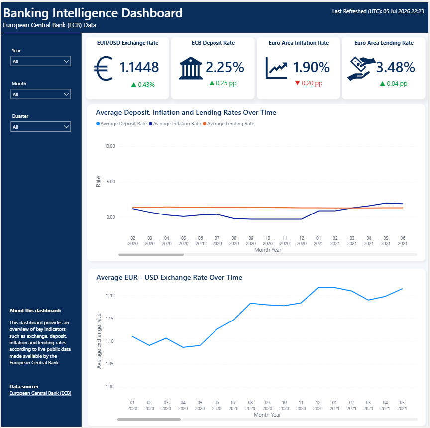
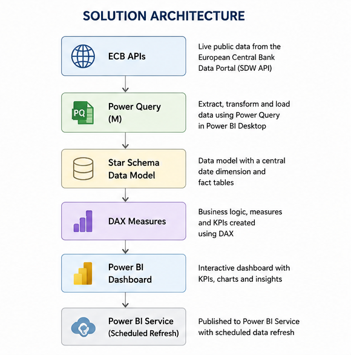
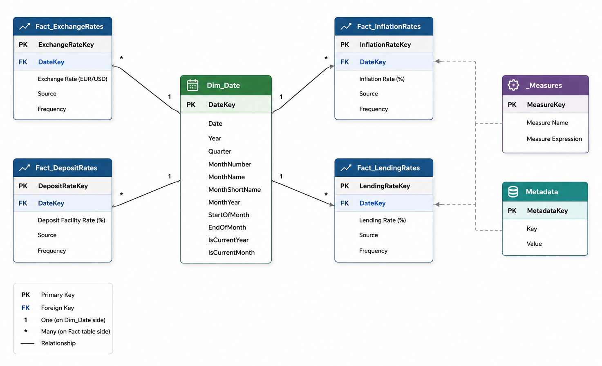

# Banking Intelligence Dashboard

A Power BI dashboard built using live public data from the European Central Bank (ECB), accessed through an API.  
The dashboard provides an overview of key monetary, inflation, exchange rate and lending indicators.

## Project Objective

The objective of this project is to demonstrate how Power BI can be used to create a banking intelligence dashboard using live macroeconomic data.

The dashboard addresses questions such as:

- What is the current ECB deposit rate?
- What is the latest Euro area inflation rate?
- How has the EUR/USD exchange rate changed over time?
- How are lending rates evolving?
- When was the dashboard last refreshed?

## Solution Overview

The solution connects to multiple ECB public API endpoints, transforms the data in Power Query, models it using a star schema, and presents the results in an interactive Power BI dashboard.

## Architecture

## Data Model

The model follows a star schema design with a central date dimension connected to multiple fact tables.

Main tables:

- Dim_Date
- Fact_ExchangeRates
- Fact_DepositRates
- Fact_InflationRates
- Fact_LendingRates
- Measures
- Metadata

## Tools Used
Power BI Desktop | Power BI Service | Power Query | DAX | ECB Data API | GitHub

## Notes

The report is built using public ECB data.
The .pbix file is included for review and learning purposes.
